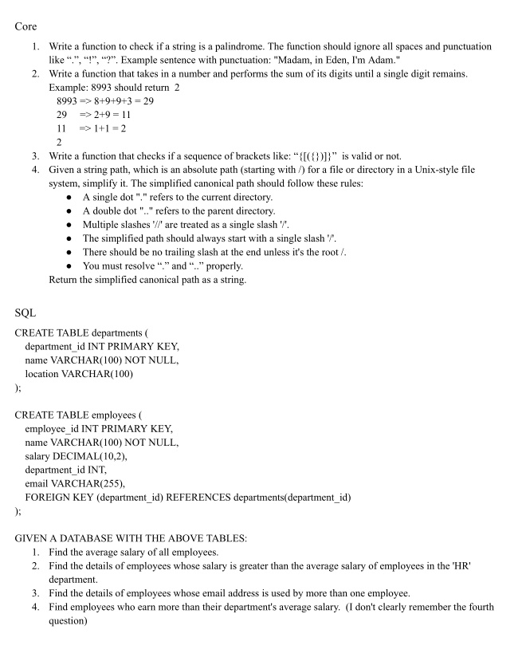

# Hexa business Nepal
- Initial test for Fullstack developer role at Hexabusiness Nepal.
- I've wrote down the questions as best as I can remember them.
- Timelimit - 1hr

## Questions
- [Question PDF](Question.pdf)
- 

# Overall Review
Pretty solid test. Could have done better. Also, I found it haliraious that I couldn't remember inbuilt function syntax and also basic function decleration. What a dumbasssss 🤦‍♂️🤦‍♂️🤦‍♂️🤦‍♂️🤦‍♂️. 

| ✅Correct syntax|  ❌ Incorrect syntax  |
| ------| ----- |
| `strtolower()`| `str_to_lower()`, `lower()`|
| `strlen()` | `str_length()`, `length()` |
| `str_replace(search_val, replace_val, subject)` | `str_replace(subject, search_val, replace_val)`|
| `function (...): return_type {}` | `function (...) return_type {}` |

---

# Solutions

## Q1. Palindrome
- My thought process was to sanitize the string .i.e remove all possible spaces and punctuations.
- Then use a 2 pointer check to check if palindrome.

### My Initial solution

```php
function checkPalindrome(string $str){
    $str = strtolower($str);
    $str = sanitizeString($str);

    $strLength = strlen($str);
    $firstPointer = 0;
    $lastPointer = $strLength - 1;
    $mid =  $strLength / 2;

    for($firstPointer = 0; $firstPointer < $mid; $firstPointer++, $lastPointer--){
        if($str[$firstPointer] !== $str[$lastPointer]){
            return false;
        }
    }

    return true;
}

function sanitizeString(string $str){
    $filterableStrings = [" ", "?", ".", ......];
    $returnString  =  "";

    foreach($str as $char){
        if(in_array($char, $filterableStrings)){
            continue;
        }

        $returnString =  $returnString.$char;
    }
    
    return $returnString;
}

```

### My updated solution would be
- turn string to lowercase
- compare with ASCII value to filter out chars
- make temp string, reverse it, and then compare it to original.

```php
function checkPalindrome(string $str): bool {
    $str = strtolower($str);
    $cleanStr = '';
    
    $minAscii = ord('a');
    $maxAscii = ord('z');
    
    for ($i = 0; $i < strlen($str); $i++) {
        $charAscii = ord($str[$i]);
        if ($charAscii >= $minAscii && $charAscii <= $maxAscii) {
            $cleanStr .= $str[$i];
        }
    }
    
    return $cleanStr === strrev($cleanStr);
}
```
### Deepseek solution

```php
function isPalindrome(string $input): bool {
    // Normalize: lowercase and remove non-alphanumeric characters
    $cleaned = preg_replace('/[^a-z0-9]/', '', strtolower($input));
    
    // Edge case: empty string after cleaning
    if ($cleaned === '') return false;
    
    // Compare with reversed string (most efficient way)
    return $cleaned === strrev($cleaned);
}
```
## Q2. DigitSum
- This was pretty simple, I immediately knew that this was a case for recursion.

```php
function digitSum(int $num){
    if(strlen((string)$num) === 1){
        return $num
    }

    $sum = 0;

    foreach($num as $char){
        $sum = $sum + (int) $char;
    }

    return digitSum($sum);
}

```

### Deepseek Solution

```php
function digitSum(int $num): int {
    $num = abs($num); // Handle negative numbers
    if (strlen((string)$num) === 1) {
        return $num;
    }

    $sum = 0;
    foreach (str_split((string)$num) as $char) {
        $sum += (int)$char; // Cast char to int before adding
    }

    return digitSum($sum); // Recursively sum until single digit
}
```

## Q3. Bracket Sequence
- I knew I could solve this one, this is a Leetcode easy problem that I had solved in the past. But I didn't rememeber remember the flow. So I doodled some cases and realized that this< needed to be solved using stack. I could have solved this properly if I gave more time to this, but heres what I basically wrote.

### My Initial Solution
```php
//Definitely wrong.
function checkSequence(string $sequence): bool {
    $stack = [];
    $pairMap = [
        "{" => "}",
        "(" => ")",
        "[" => "]",
        "}" => "{",
        ")" => "(",
        "]" => "["
    ];

    foreach (str_split($sequence) as $bracket) {
        if (canPush($bracket, $stack, $pairMap)) {
            $stack[] = $bracket;
            continue;
        }

        if (canPop($bracket, $stack, $pairMap)) {
            array_pop($stack);
            continue;
        }
    }
    
    return empty($stack);
}

function canPush(string $bracket, array $stack, array $pairMap): bool {
    if (empty($stack)) {
        return true;
    }

    $lastIndex = count($stack) - 1;
    $lastBracket = $stack[$lastIndex];
    
    return isset($pairMap[$lastBracket]) && $bracket === $pairMap[$lastBracket];
}

function canPop(string $bracket, array $stack, array $pairMap): bool {
    if (empty($stack)) {
        return false;
    }

    $lastIndex = count($stack) - 1;
    $lastBracket = $stack[$lastIndex];
    
    return isset($pairMap[$bracket]) && $pairMap[$bracket] === $lastBracket;
}
```

### My updated soultion would be:

```js
var isValid = function(s) {
    const stack      = [];
    const bracketMap = {
        "}": "{",
        ")": "(",
        "]": "["
    }

   for(let i = 0 ; i<s.length; i++){
        const bracket = s[i];

        if(isOpeningBracket(bracket)){
            stack.push(bracket)
        }else if(hasRespOpeningBracketOnTop(stack, bracket)){
            stack.pop();
        }else{
            return false;
        }
    }

    if(stack.length>0){
        return false
    }
    
    return true;

    function isOpeningBracket(bracket){
        return Object.values(bracketMap).includes(bracket);
    }

    function hasRespOpeningBracketOnTop(stack, bracket){
        return stack[stack.length-1] === bracketMap[bracket]
    }
};
``` 
### Deepseek solution

```php
function isValid(string $s): bool {
    $stack = [];
    $bracketMap = [
        ')' => '(',
        '}' => '{',
        ']' => '['
    ];

    for ($i = 0; $i < strlen($s); $i++) {
        $char = $s[$i];
        
        if (array_key_exists($char, $bracketMap)) {
            // Closing bracket: check if top of stack matches
            if (array_pop($stack) !== $bracketMap[$char]) {
                return false;
            }
        } else {
            // Opening bracket: push to stack
            array_push($stack, $char);
        }
    }

    return empty($stack);
}
```
## Q4. File path

- I didn't even try this because I did not understand the question.

---


>[!NOTE]
> For all sql queries I used CTEs because I personally like writing CTE's instead of subquery because of their readibility and usability. I basically wrote or tried writing these queries

## Q5. Average Salary of All Employees
```
WITH avg_salary AS (
    SELECT AVG(salary) AS overall_avg_salary
    FROM employees
)
SELECT overall_avg_salary
FROM avg_salary;
```

## Q6. Employees Earning More Than HR Department's Average Salary

```
WITH hr_avg AS (
    SELECT AVG(e.salary) AS hr_avg_salary
    FROM employees e
    JOIN departments d ON e.department_id = d.department_id
    WHERE d.name = 'HR'
)
SELECT e.*
FROM employees e
CROSS JOIN hr_avg
WHERE e.salary > hr_avg.hr_avg_salary;
```


## Q7. Employees with Duplicate Email Addresses

```
WITH email_counts AS (
    SELECT email, COUNT(*) AS email_count
    FROM employees
    WHERE email IS NOT NULL
    GROUP BY email
    HAVING COUNT(*) > 1
)
SELECT e.*
FROM employees e
JOIN email_counts ec ON e.email = ec.email;
```


## Q8. Employees Earning More Than Their Department's Average Salary

```
WITH dept_avg AS (
    SELECT 
        department_id,
        AVG(salary) AS avg_department_salary
    FROM employees
    GROUP BY department_id
)
SELECT e.*
FROM employees e
JOIN dept_avg da ON e.department_id = da.department_id
WHERE e.salary > da.avg_department_salary;
```